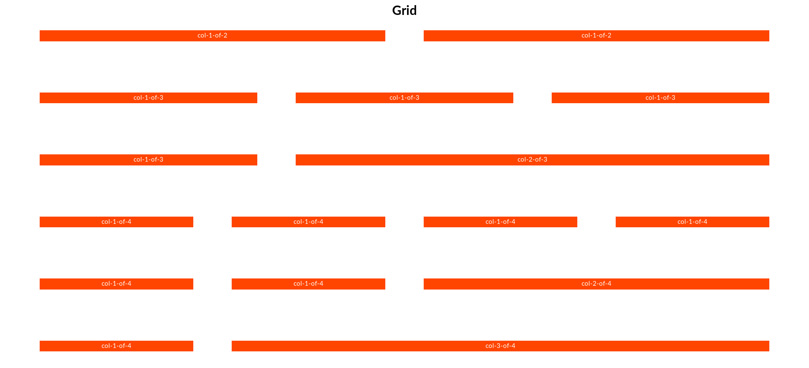

# Grid layout

Fancy.css make easy of using grid layouts. We provide 3 sizes os grid. 2 cols, 3 cols and 4 cols.



Each col class must be inside an row

```html
<div class="row">
	<div class="col-1-of-2">
		col-1-of-2
	</div>
	<div class="col-1-of-2">
		col-1-of-2
	</div>
</div>

<div class="row">
	<div class="col-1-of-3">
		col-1-of-3
	</div>
	<div class="col-1-of-3">
		col-1-of-3
	</div>
	<div class="col-1-of-3">
		col-1-of-3
	</div>
</div>

<div class="row">
	<div class="col-1-of-3">
		col-1-of-3
	</div>
	<div class="col-2-of-3">
		col-2-of-3
	</div>
</div>

<div class="row">
	<div class="col-1-of-4">
		col-1-of-4
	</div>
	<div class="col-1-of-4">
		col-1-of-4
	</div>
	<div class="col-1-of-4">
		col-1-of-4
	</div>
	<div class="col-1-of-4">
		col-1-of-4
	</div>
</div>

<div class="row">
	<div class="col-1-of-4">
		col-1-of-4
	</div>
	<div class="col-1-of-4">
		col-1-of-4
	</div>
	<div class="col-2-of-4">
		col-2-of-4
	</div>
</div>

<div class="row">
	<div class="col-1-of-4">
		col-1-of-4
	</div>
	<div class="col-3-of-4">
		col-3-of-4
	</div>
</div>
```
